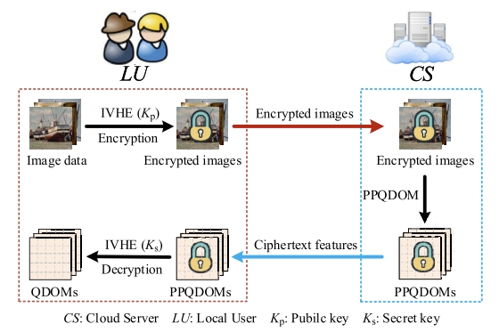

# Privacy-preserving color image feature extraction by quaternion discrete orthogonal moments

[[Paper]]([https:](https://ieeexplore.ieee.org/abstract/document/9762698/))

## Approach



## Citation
```
@article{bi2022privacy,
  title={Privacy-preserving color image feature extraction by quaternion discrete orthogonal moments},
  author={Bi, Xiuli and Shuai, Chao and Liu, Bo and Xiao, Bin and Li, Weisheng and Gao, Xinbo},
  journal={IEEE Transactions on Information Forensics and Security},
  volume={17},
  pages={1655--1668},
  year={2022},
  publisher={IEEE}
}
```
